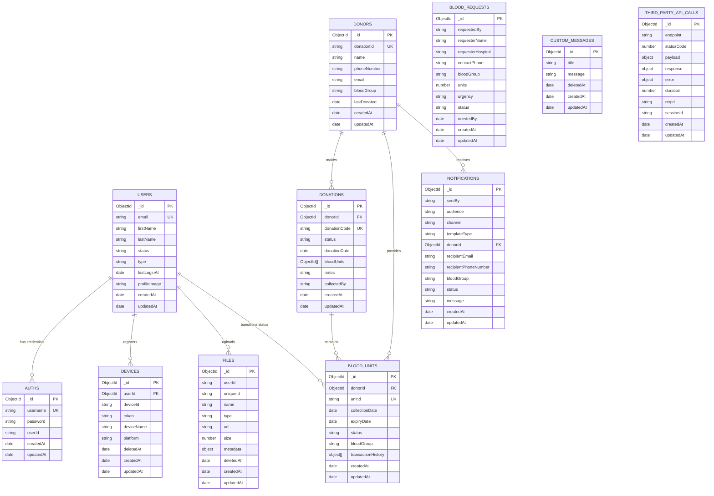

# Database Schema

This document describes the MongoDB schema used by the Blood Bank Management System.

## ER Diagram (High-Level)

## Data Dictionary (Core Collections)

### Users Collection:
- `user_id` (`ObjectId`, Primary Key) → stored as `_id`
- `name` (`String`) → represented by `firstName` + `lastName`
- `email` (`String`, Unique)
- `password` (`String`, Hashed) → stored in related `auths.password`
- `role` (`Enum`) → stored as `type` (`ADMIN`, `LAB_REP`, `HOSPITAL_REP`, `USER`)

### Donors Collection:
- `donor_id` (`ObjectId`, Primary Key) → stored as `_id`
- `fullName` (`String`) → stored as `name`
- `bloodGroup` (`Enum`: `A+`, `A-`, `B+`, `B-`, `AB+`, `AB-`, `O+`, `O-`)
- `lastDonationDate` (`Date`) → stored as `lastDonated`

### BloodUnits Collection (The Core Inventory):
- `unit_id` (`ObjectId`, Primary Key) → stored as `_id` (business key: `unitId`)
- `donor_id` (`ObjectId`, Foreign Key referencing Donors) → stored as `donorId`
- `collectionDate` (`Date`)
- `expiryDate` (`Date`)
- `status` (`Enum`: `DONATED`, `QUARANTINED`, `SCREENED`, `AVAILABLE`, `RESERVED`, `DISPATCHED`, `EXPIRED`)

### LabResults Collection:
- Current implementation note: there is no standalone `lab_results` collection yet.
- Lab screening workflow is represented through blood unit lifecycle transitions and audit history.
- Equivalent tracked fields are in `blood_units.transactionHistory[]`:
  - `fromStatus` (`String`)
  - `toStatus` (`String`)
  - `userId` (`ObjectId`, reference to Users)
  - `userName` (`String`)
  - `timestamp` (`Date`)

## Collections and Key Fields

### `users`
- PK: `_id`
- Unique: `email`
- Important fields: `firstName`, `lastName`, `status`, `type`, `lastLoginAt`
- Model: `src/modules/users/models/user.model.ts`

### `auths`
- PK: `_id`
- Unique: `username`
- Relation: `userId` → user identity reference
- Model: `src/modules/auth/models/auth.model.ts`

### `donors`
- PK: `_id`
- Unique: `donationId`
- Indexed/search fields: `name`, `phoneNumber`, `email`, `bloodGroup`
- Model: `src/modules/blood-donation/models/donor.model.ts`

### `donations`
- PK: `_id`
- Unique: `donationCode`
- Relations:
  - `donorId` → `donors._id`
  - `bloodUnits[]` → `blood_units._id`
- Model: `src/modules/blood-donation/models/donation.model.ts`

### `blood_units`
- PK: `_id`
- Unique: `unitId`
- Relation: `donorId` → `donors._id`
- Embedded audit trail: `transactionHistory[]` (`fromStatus`, `toStatus`, `userId`, `userName`, `timestamp`)
- Model: `src/modules/blood-donation/models/bloodUnit.model.ts`

### `blood_requests`
- PK: `_id`
- Operational fields: `requesterHospital`, `bloodGroup`, `units`, `urgency`, `status`
- Model: `src/modules/requests/models/request.model.ts`

### `notifications`
- PK: `_id`
- Relation: optional `donorId` → donor target
- Operational fields: `audience`, `channel`, `templateType`, `status`, `message`
- Model: `src/modules/notifications/models/notification.model.ts`

### `files`
- PK: `_id`
- Composite unique index: `(userId, uniqueId)`
- Soft delete: `deletedAt`
- Model: `src/modules/files/models/file.model.ts`

### `devices`
- PK: `_id`
- Relation: `userId` → `users._id`
- Soft delete: `deletedAt`
- Model: `src/modules/notifications/models/device.model.ts`

### `custom_messages`
- PK: `_id`
- Fields: `title`, `message`, `deletedAt`
- Model: `src/modules/notifications/models/custom-message.model.ts`

### `third_party_api_calls`
- PK: `_id`
- Audit/log fields: `endpoint`, `statusCode`, `payload`, `response`, `error`, `duration`
- Model: `src/externalServices/models/third-party-api-calls.model.ts`

## Notes
- Schemas use Mongoose with timestamps (`createdAt`, `updatedAt`) in most collections.
- Several collections use `mongoose-paginate-v2` for list endpoints.
- Some relations are stored as `ObjectId` refs, while some legacy links are plain strings (`userId`, `requestedBy`, `sentBy`).
