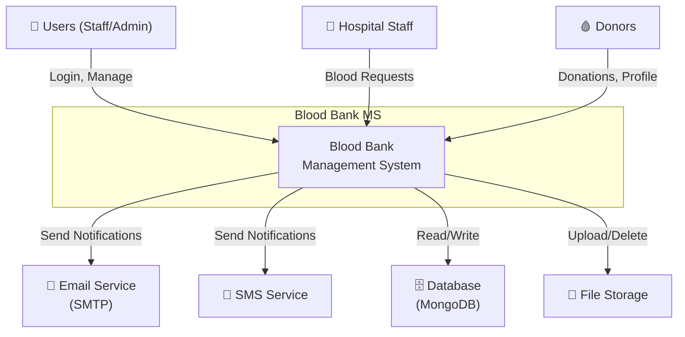
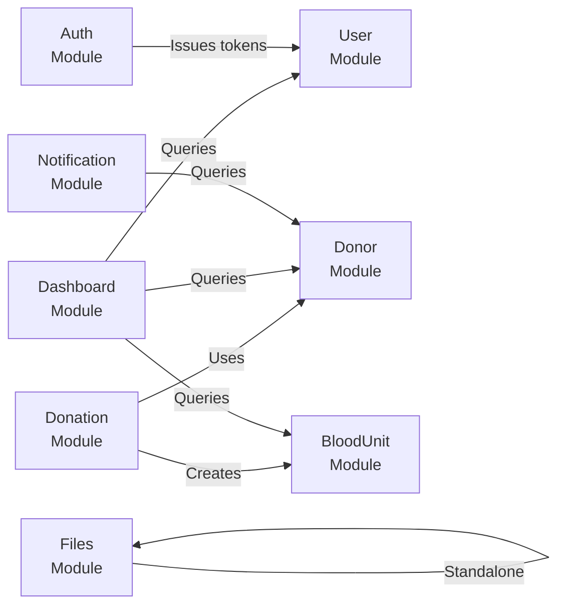
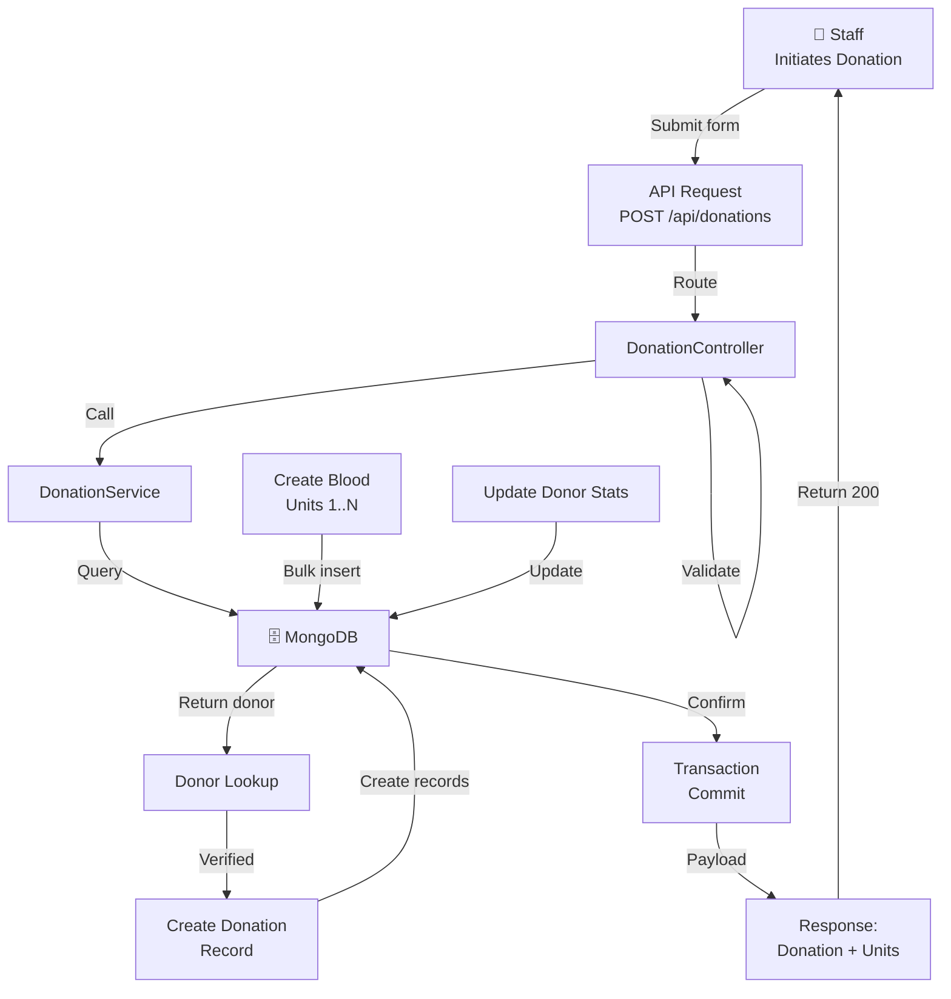
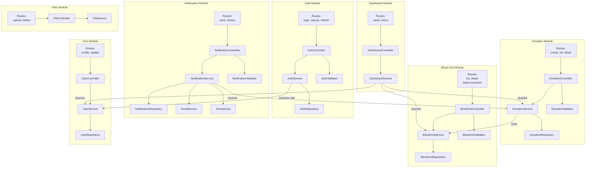
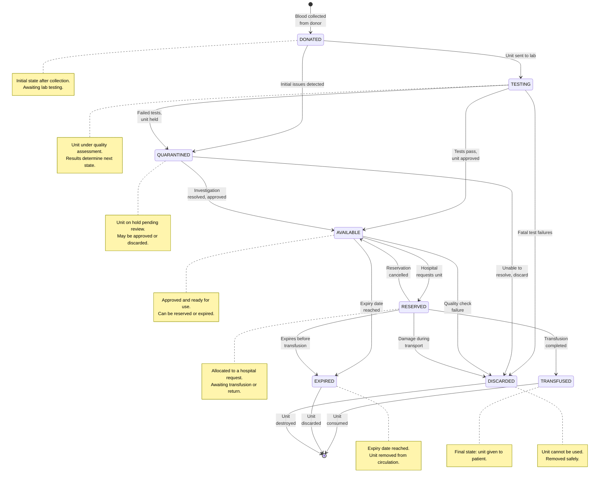

# Blood Bank MS – Architecture UML Diagrams

This document provides high-level System Context and Component diagrams for onboarding and architecture reference.

## How to Use

- Render in GitHub Markdown, VS Code Markdown Preview, or Mermaid Live Editor.
- Diagrams provide a 10,000-foot view of system boundaries and internal organization.

---

## 1) System Context Diagram

Shows the Blood Bank Management System and its interactions with external actors and systems.

---

## 2) High-Level Component Diagram

Shows the internal modular structure and key dependencies.

```mermaid
graph TB
    subgraph "Presentation Layer"
        ViewRouter["View Router<br/>(EJS Pages)"]
        Partial["Partials<br/>(Sidebar, Header, etc)"]
    end
    
    subgraph "API Layer"
        APIRouter["API Router<br/>(/api/*)"]
        Auth["Auth Routes"]
        Donation["Donation Routes"]
        Dashboard["Dashboard Routes"]
        Files["Files Routes"]
        Notif["Notification Routes"]
    end
    
    subgraph "Middleware & Utils"
        AuthMW["UserMiddleware<br/>(Authentication)"]
        Validator["Validators<br/>(Joi)"]
        Logger["Logger<br/>(Winston)"]
        Response["StandardResponse"]
    end
    
    subgraph "Business Logic Layer"
        AuthS["AuthService"]
        DonorS["DonorService"]
        DonationS["DonationService"]
        BloodUnitS["BloodUnitService"]
        DashboardS["DashboardService"]
        NotifS["NotificationService"]
        FileS["FileService"]
    end
    
    subgraph "Data Access Layer"
        AuthRepo["AuthRepository"]
        DonorRepo["DonorRepository"]
        DonationRepo["DonationRepository"]
        BloodUnitRepo["BloodUnitRepository"]
        NotifRepo["NotificationRepository"]
        UserRepo["UserRepository"]
    end
    
    subgraph "External Integrations"
        EmailSvc["EmailService<br/>(Nodemailer + React)"]
        SMSSvc["SmsService<br/>(Logger-based)"]
        FileStore["File Storage"]
    end
    
    subgraph "Data Models"
        UserModel["User Model"]
        DonorModel["Donor Model"]
        DonationModel["Donation Model"]
        BloodUnitModel["BloodUnit Model"]
        NotifModel["Notification Model"]
    end
    
    ViewRouter -->|Uses| Partial
    APIRouter --> Auth
    APIRouter --> Donation
    APIRouter --> Dashboard
    APIRouter --> Files
    APIRouter --> Notif
    
    Auth -->|Uses| AuthMW
    Donation -->|Uses| AuthMW
    Dashboard -->|Uses| AuthMW
    Files -->|Uses| AuthMW
    Notif -->|Uses| AuthMW
    
    Auth -->|Validate| Validator
    Donation -->|Validate| Validator
    Notif -->|Validate| Validator
    
    Auth -->|Call| AuthS
    Donation -->|Call| DonorS
    Donation -->|Call| DonationS
    Donation -->|Call| BloodUnitS
    Dashboard -->|Call| DashboardS
    Notif -->|Call| NotifS
    Files -->|Call| FileS
    
    AuthS -->|Query| AuthRepo
    DonorS -->|Query| DonorRepo
    DonationS -->|Query| DonationRepo
    BloodUnitS -->|Query| BloodUnitRepo
    NotifS -->|Query| NotifRepo
    DashboardS -->|Query| DonorRepo
    DashboardS -->|Query| BloodUnitRepo
    DashboardS -->|Query| UserRepo
    
    AuthRepo -->|Read/Write| UserModel
    DonorRepo -->|Read/Write| DonorModel
    DonationRepo -->|Read/Write| DonationModel
    BloodUnitRepo -->|Read/Write| BloodUnitModel
    NotifRepo -->|Read/Write| NotifModel
    
    NotifS -->|Send| EmailSvc
    NotifS -->|Send| SMSSvc
    FileS -->|Manage| FileStore
    
    AuthS -->|Log| Logger
    DonationS -->|Log| Logger
    BloodUnitS -->|Log| Logger
    NotifS -->|Log| Logger
    
    Auth -->|Format| Response
    Donation -->|Format| Response
    Dashboard -->|Format| Response
    Files -->|Format| Response
    Notif -->|Format| Response
```

---

## 3) Module Dependency Graph (Simplified)

Shows cross-module dependencies without data models.

---

## 4) Data Flow Overview

Shows how data flows through the system during a typical donation creation scenario.

---

## 5) Detailed Module Component Diagram

Shows the boundaries and interfaces of each major module with internal organization.

---

## 6) Blood Unit State Diagram (Lifecycle)

Shows all possible states and valid transitions for a blood unit.

---

## Architecture Principles

- **Layered Architecture**: Routes → Controllers → Services → Repositories → Models.
- **Middleware**: Authentication, logging, and response formatting applied globally.
- **Transaction Support**: Critical multi-step operations (donations) use DB transactions.
- **Separation of Concerns**: Domain logic in services, data access in repositories, HTTP concerns in controllers.
- **External Integrations**: Email/SMS decoupled via services; file storage abstracted.
- **State Management**: Blood unit lifecycle enforced via transitions; invalid transitions rejected by service layer.

---

## Links to Related Documentation

- **Flowchart Scenarios** (detailed control flow): [`README-UML.md`](./README-UML.md)
- **Sequence Diagrams** (high-level interactions): [`README-UML-SEQUENCE.md`](./README-UML-SEQUENCE.md)
