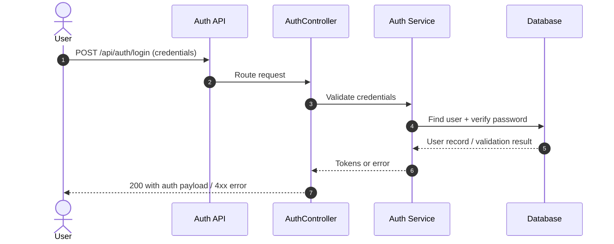
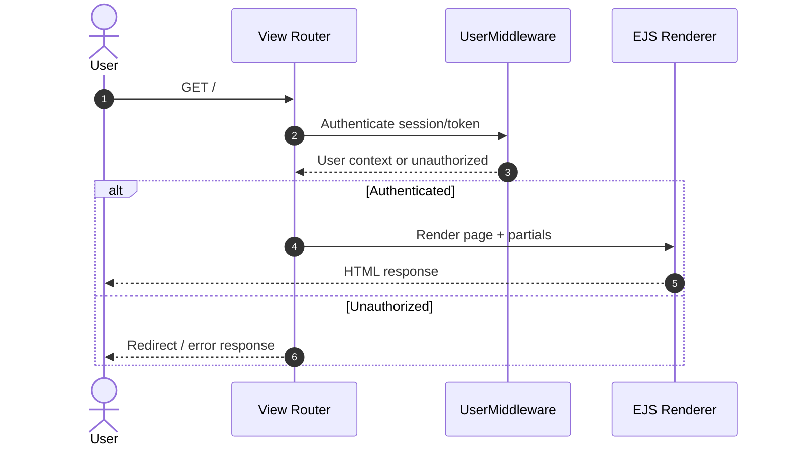
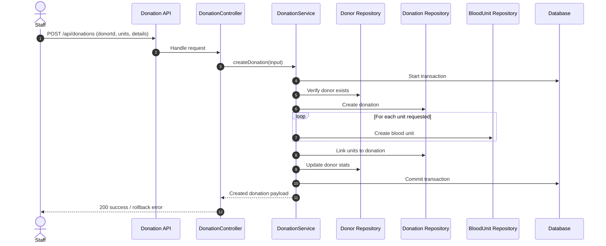
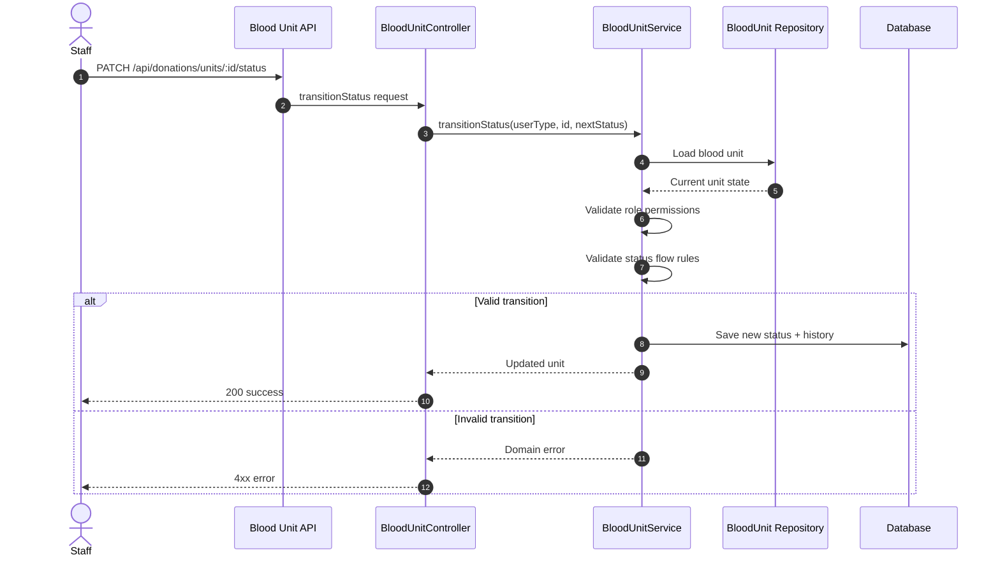
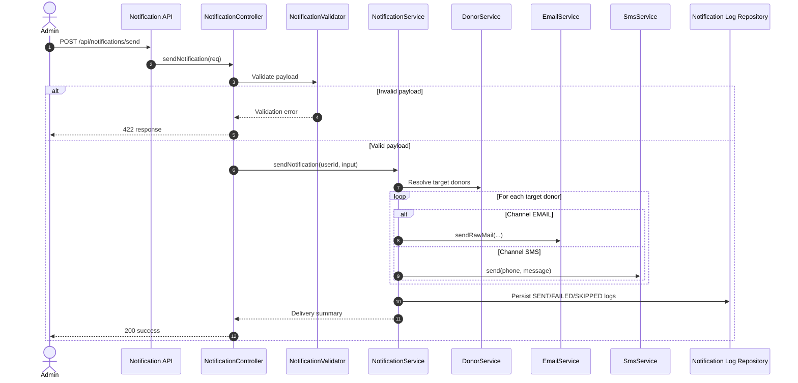
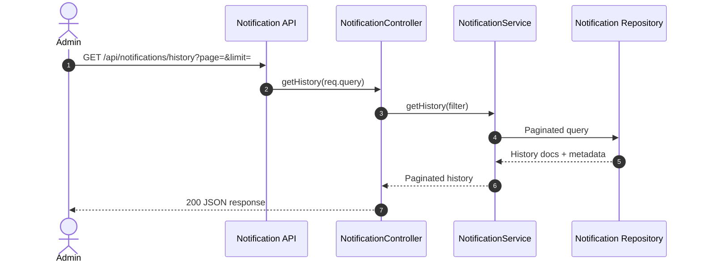
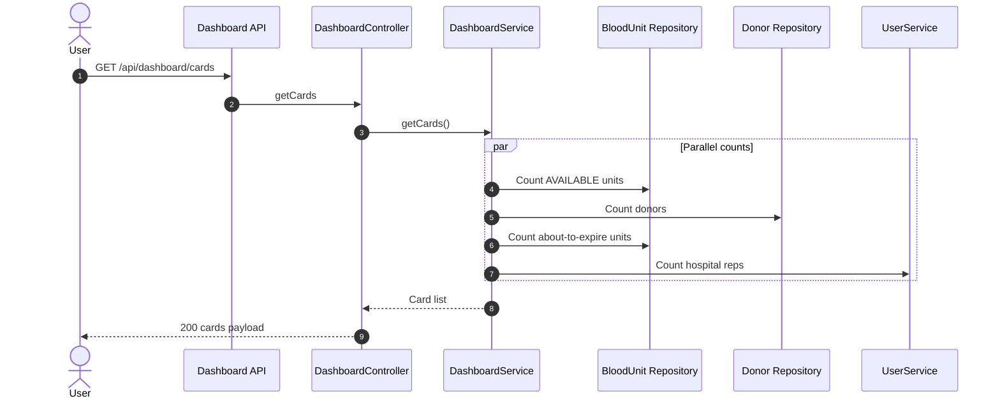
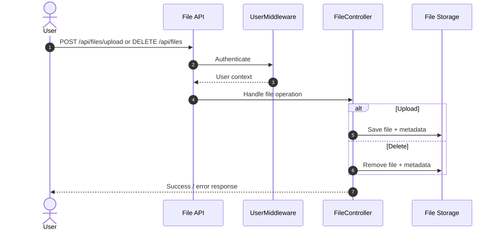
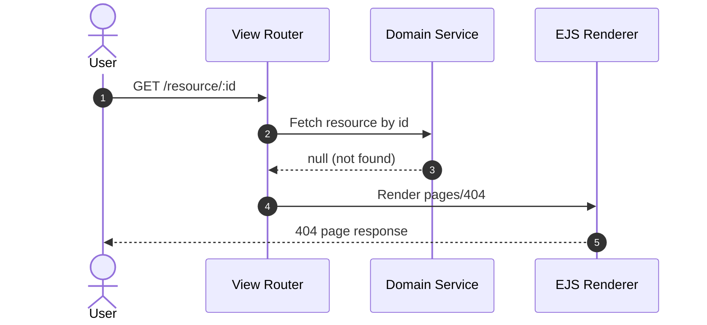

# Blood Bank MS – High-Level UML Sequence Diagrams

This document provides high-level UML sequence diagrams for key scenarios in the app.

## How to Use

- Render in GitHub Markdown, VS Code Markdown Preview, or Mermaid Live Editor.
- Diagram type used: `sequenceDiagram`.
- Scope is intentionally high-level (actors, layers, outcomes).

---

## 1) User Login

## 2) Authenticated Page Load (Dashboard/Home)

## 3) Create Donation (Transaction + Blood Units)

## 4) Blood Unit Status Transition

## 5) Notification Send (Broadcast or Single Donor)

## 6) Notification History Query

## 7) Dashboard Cards Aggregation

## 8) File Upload / Delete

## 9) 404 / Missing Resource Path

---

## Related Documentation

- **Flowcharts** (detailed control flow): [`README-UML.md`](./README-UML.md)
- **Architecture diagrams** (system context, components): [`README-UML-ARCHITECTURE.md`](./README-UML-ARCHITECTURE.md)
