# Blood Bank MS – UML Flowchart Scenarios

This document provides UML-style flowchart diagrams (via Mermaid) for the main scenarios in the app.

## How to Use

- Render these diagrams in GitHub, VS Code Markdown Preview, or any Mermaid-compatible tool.
- Diagram type used: `flowchart`.
- API base path: `/api`.

---

## 1) Global Request Lifecycle

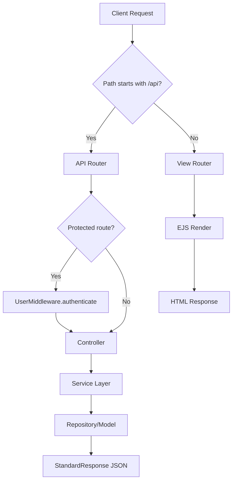

## 2) Authentication: Login / Signup / Token Refresh

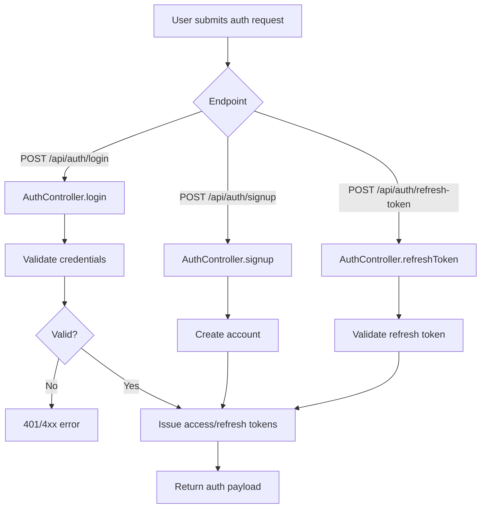

## 3) Password & Verification Flow

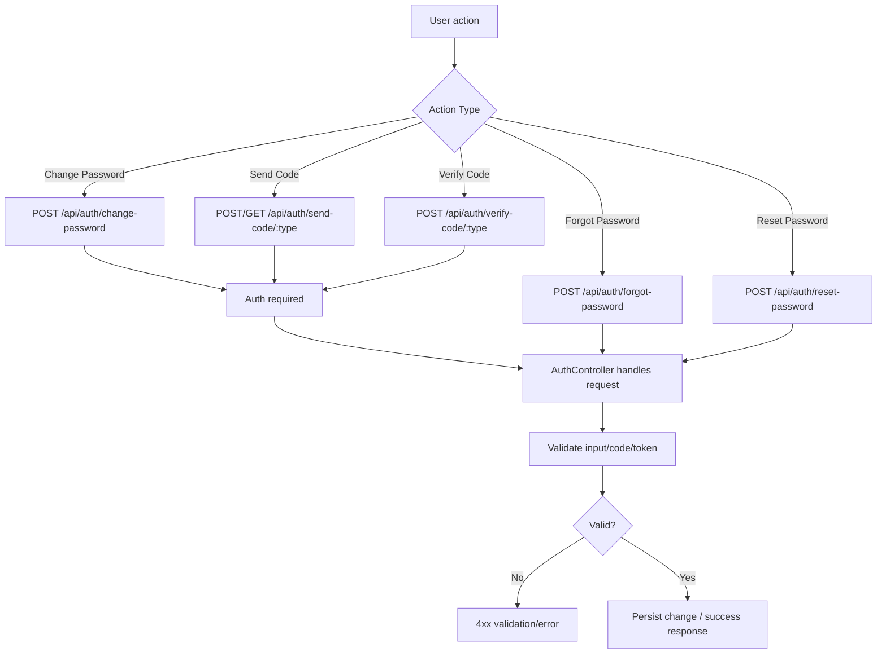

## 4) Dashboard Data Flow

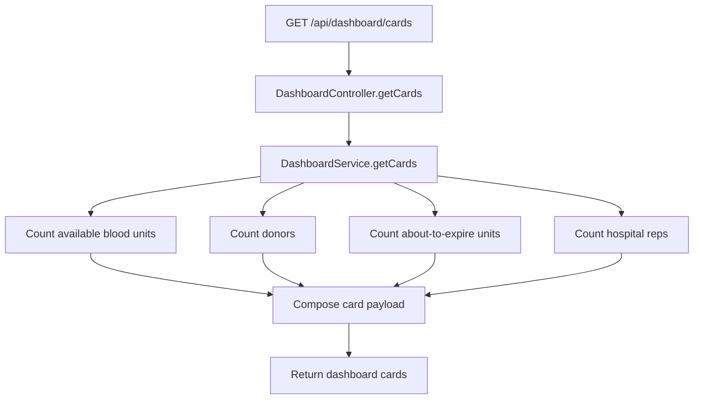

## 5) Donor Management (List / Create / Update / Details)

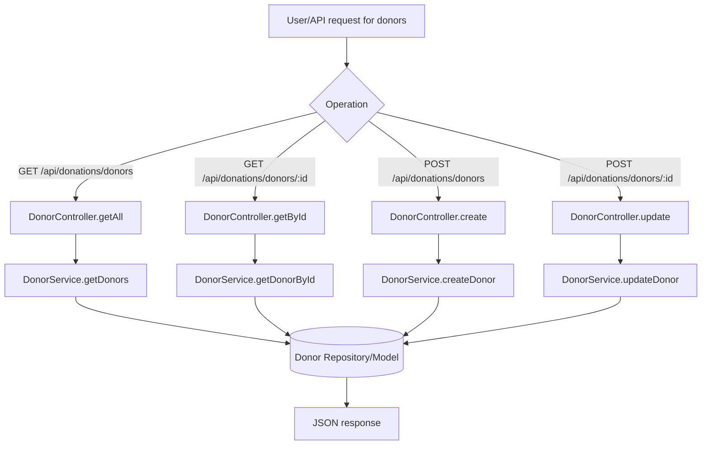

## 6) Donation Creation Flow (with Blood Unit Generation)

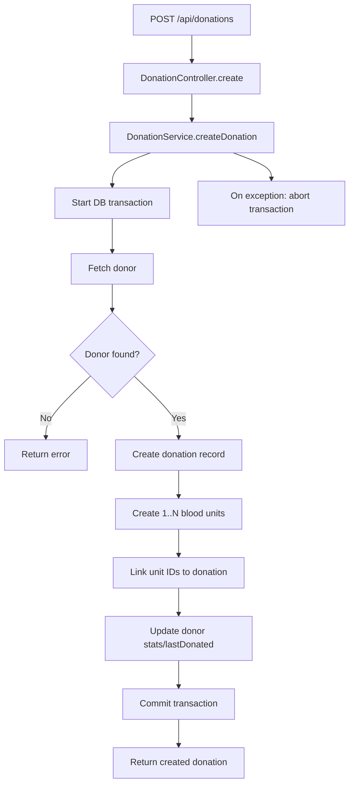

## 7) Donation Listing & Detail Flow

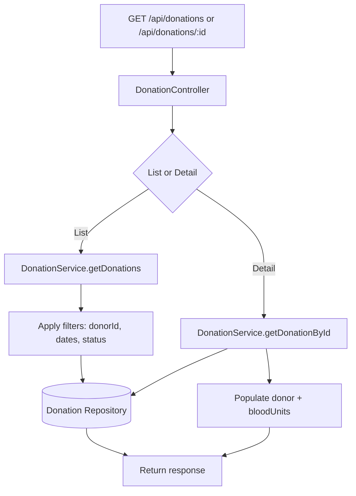

## 8) Blood Unit Inventory, FEFO, and Percentages

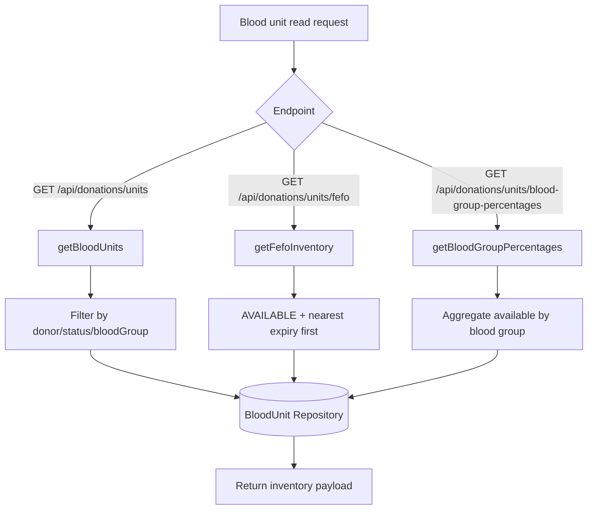

## 9) Blood Unit Status Transition Flow

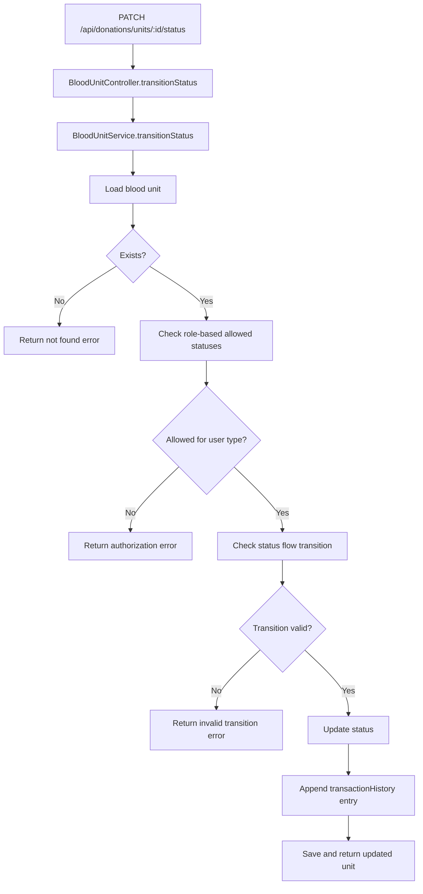

## 10) Notification History Flow

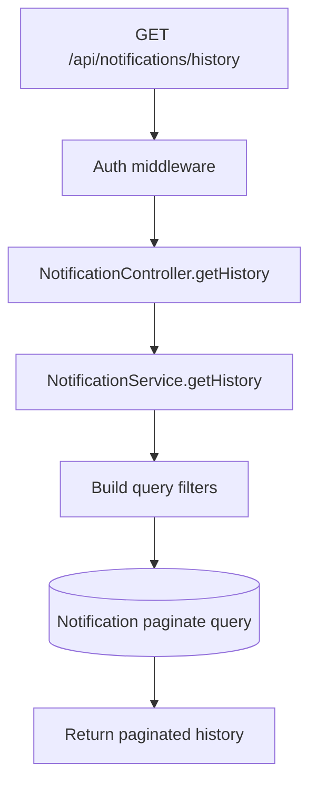

## 11) Notification Send Flow (Broadcast / Single Donor, Email or SMS)

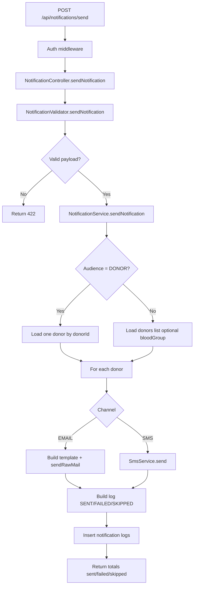

## 12) File Upload & Delete Flow

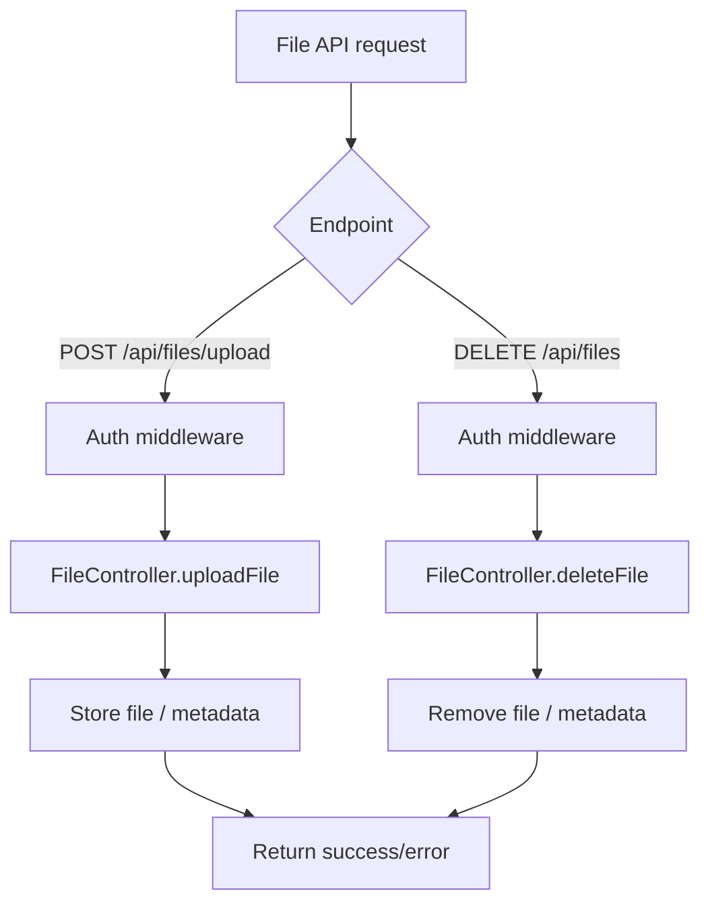

## 13) View Rendering Scenarios (EJS)

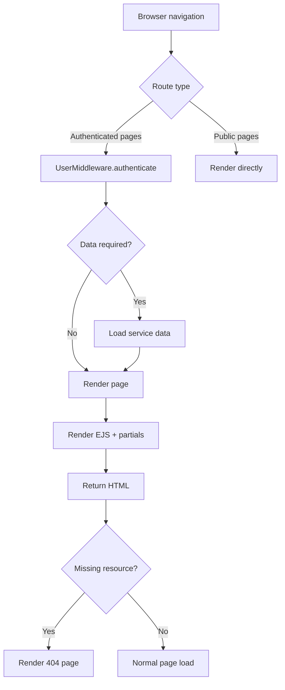

## 14) Scheduled Jobs (Cron) – Current State

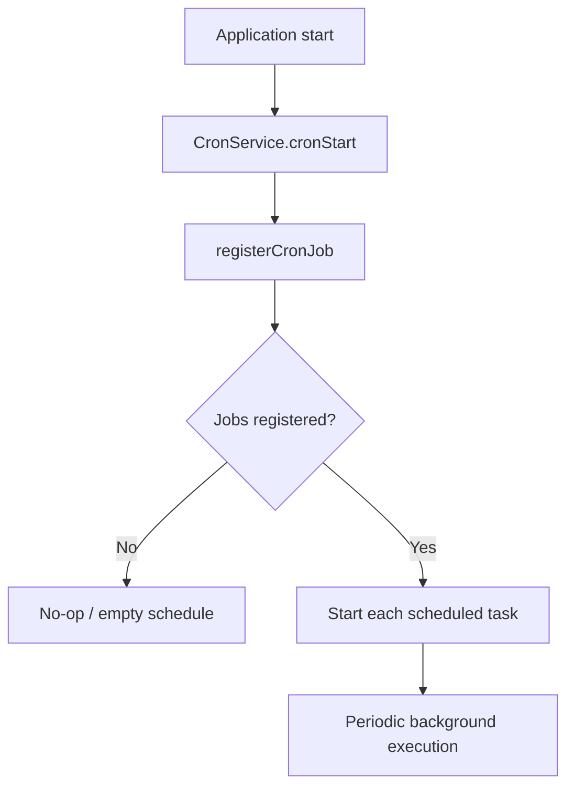

---

## Suggested Next UML Additions

- Sequence diagrams for `NotificationController -> NotificationService -> EmailService`.
- State diagram for blood unit lifecycle (`DONATED -> TESTING -> AVAILABLE -> ...`).
- Component diagram for module boundaries (auth, donation, dashboard, notifications, files).
